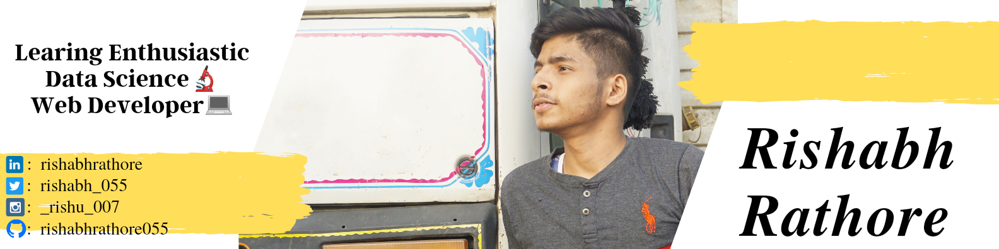

 
<h1 align="center">Hi 👋, I'm Rishabh Rathore</h1>

- 🔭 I’m currently working on **Data Science Conpects**

- 🌱 I’m currently learning **Data Analytics, SQL, Data Structure.**

- 👨‍💻 All of my projects are available at [Github](https://github.com/rishabhrathore055)

- 💬 Ask me about **Web-Devlopment, Python, Data Science**

- 📫 Reach me [here](mailto:Rishabhrathore055@gmail.com)

- ⚡ Fun fact **. I have a really big heart, and I empathize with others very easily.**

  <b><i>Let's connect! Find me on the web.</i></b>

      
  <a href="mailto:falgunisarkar526@gmail.com">
    &nbsp;
  </a>
  <a href="https://www.linkedin.com/in/Rishabhrathore">
    &nbsp;
  </a>
  <a href="https://twitter.com/rishabh_055">
    &nbsp;
  </a>
  <a href="https://www.instagram.com/_rishu_007">
    &nbsp;
  </a>
  <a href="https://www.facebook.com/rishi.rishabh04">
    &nbsp;
  </a>
  <a href="https://https://youtube.com/channel/UCyQxG1NPrjhMtgFqlm8k9Cw">
    &nbsp;
  </a>
  <a href="https://dev.to/rishabh055">
    &nbsp;
  </a>

<i><b>Languages and Tools:</b></i> 
  
 &nbsp;
  &nbsp;
  &nbsp;
  &nbsp;
  &nbsp;
  &nbsp;
    
  &nbsp;
  &nbsp;
  &nbsp;
  &nbsp;
  &nbsp;
  &nbsp;
  &nbsp;
  &nbsp;

  <i><b>GitHub Stats:octocat::</b></i>  
  
    
  

